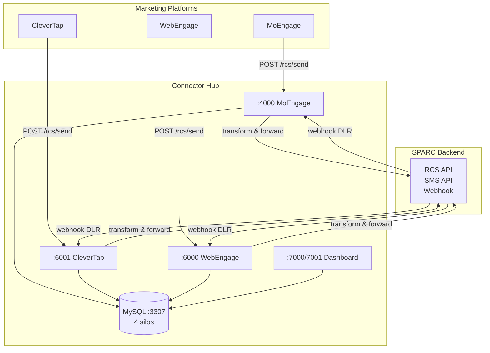
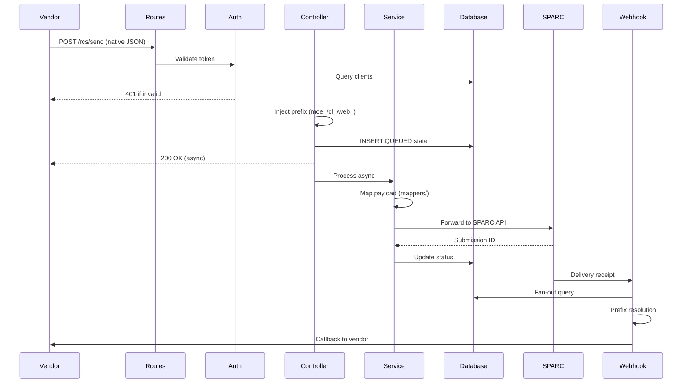
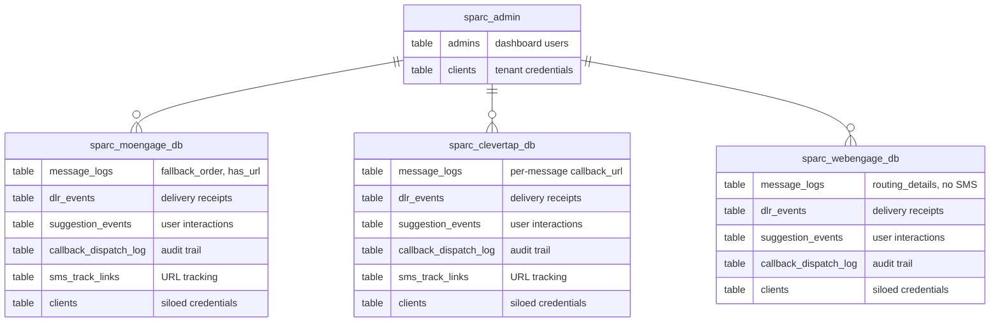
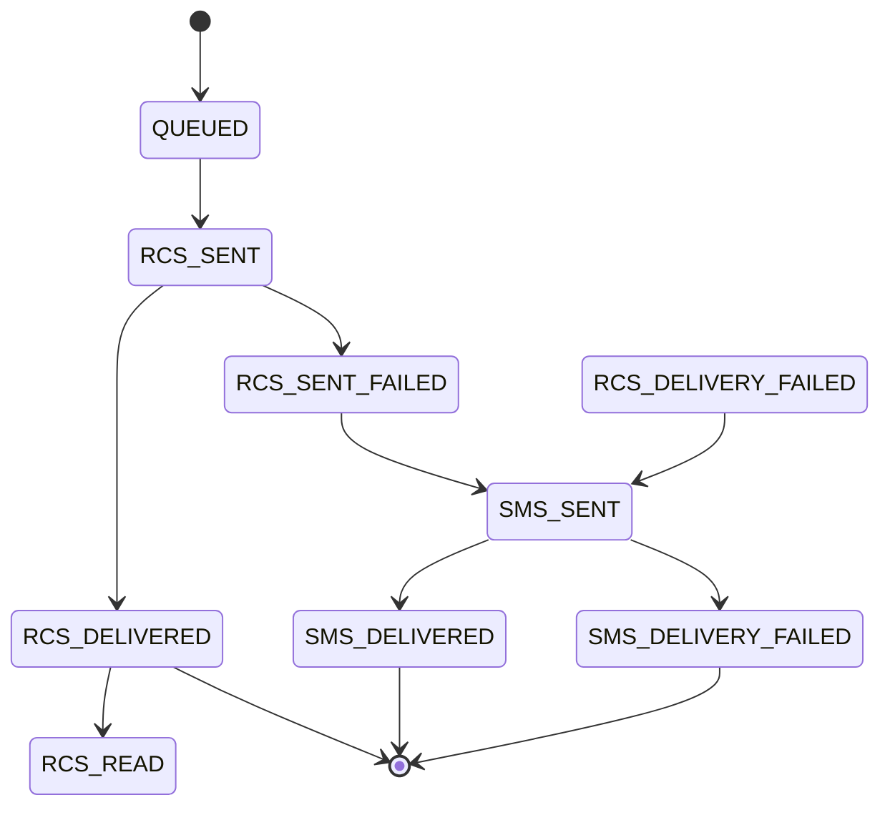

# Connectors Hub

**SPARC Connector Hub** — Multi-Vendor RCS/SMS Middleware bridging MoEngage, CleverTap, WebEngage with Smartping's CPaaS backend.

---

## 1. System Overview

An intelligent integration hub that abstracts SPARC's API complexity, payload formatting, DLT compliance, and fallback logic. Vendors send native JSON payloads and receive delivery receipts in their expected formats.

| Attribute | Value |
|---|---|
| Pattern | Controller-Service-Repository |
| Runtime | Node.js 20 (Alpine Docker) |
| Framework | Express 4.x |
| Database | MySQL 8.0 (4 isolated silos) |
| Frontend | React 18 + TypeScript + Vite 5 |
| Containerization | Docker Compose (5 services) |

---

## 2. Architecture



### Principles

- **Immediate ACK + Async** — All inbound returns 200 synchronously, processing continues async
- **Auto-Prefixing** — `moe_`/`cl_`/`web_` prepended to message IDs to prevent cross-vendor collision
- **Fan-Out Queries** — Webhook DLR with unknown source queries all 3 vendor DBs in parallel via `Promise.all`
- **Graceful Shutdown** — `SIGTERM` → close HTTP → drain MySQL pools → exit
- **Retry with Backoff** — Callback dispatcher: 3 retries (1s/2s/3s). SPARC client: `axios-retry` exponential backoff
- **DLT Compliance** — SMS fallback uses `unicode: 0` (GSM-7) to prevent silent carrier drops

---

## 3. Data Flow



### Step-by-Step

1. **Vendor Request** — POST with RCS campaign payload
2. **Routing & Auth** — Express intercepts, rate-limits (20k/min), validates Bearer/Basic token against `sparc_admin.clients`
3. **Controller** — Validates JSON, injects message ID prefix, writes `QUEUED` state to vendor silo DB, returns `200 OK` immediately
4. **Service** — Translates payload via pure mapper functions, dispatches to SPARC via Axios with retry, records SPARC submission ID
5. **Webhook** — SPARC hits unified `/sparc/webhook`, system resolves prefix, translates status to vendor format, writes DLR
6. **Callback** — `callbackDispatcher.js` POSTs translated DLR to vendor webhook URL, retries 3x on failure, logs all attempts

---

## 4. Infrastructure (Docker Compose)

| Service | Port(s) | Image | Healthcheck |
|---|---|---|---|
| `mysql` | `3307:3306` | `mysql:8.0` | `mysqladmin ping` |
| `moengage` | `4000:4000` | Build from `./moengage-microservice` | `wget /health` |
| `clevertap` | `6001:6001` | Build from `./clevertap-microservice` | `wget /health` |
| `webengage` | `6000:6000` | Build from `./webengage-microservice` | `wget /health` |
| `dashboard-hub` | `7000:7000` / `7001:7001` | Build from `./sparc-dashboard-hub` | `wget :7001/health` |

**Common patterns:** All Node services use `node:20-alpine`, `nodemon` for dev, mount app directory as volume, load `.env`, receive `DB_HOST=mysql`. MySQL healthcheck gates all startups. Single named volume `mysql_data`.

---

## 5. Database



### Silo Differences

| Database | `message_logs` Key Difference |
|---|---|
| `sparc_moengage_db` | Has `fallback_order`, `has_url`; no per-message `callback_url` |
| `sparc_clevertap_db` | Has per-message `callback_url`; all SMS fallback columns |
| `sparc_webengage_db` | Uses `routing_details` instead of `fallback_order`; no `has_url`/`sparc_transaction_id` |

### Status Lifecycle



### Core Tables (per vendor silo)

| Table | Purpose | Key Columns |
|---|---|---|
| `clients` | Multi-tenant credentials | `client_name`, `bearer_token` (SHA-256), `rcs_*`, `sms_*`, `is_active` |
| `message_logs` | Outbound message lifecycle | `callback_data` (prefixed), `destination`, `status`, `bot_id`, `template_name`, `message_type`, `raw_payload` |
| `dlr_events` | Delivery receipt log | `callback_data`, `sparc_status`, `moe_status`, `error_message`, `callback_dispatched` |
| `suggestion_events` | User interactions | `callback_data`, `suggestion_text`, `postback_data`, `callback_dispatched` |
| `callback_dispatch_log` | Outbound callback audit | `callback_data`, `payload_type`, `attempt_number`, `http_status`, `success` |
| `sms_track_links` | URL tracking for SMS | `target_url`, `track_link_id` |

---

## 6. Core Engines

### 6.1 Inbound Engine & ID Collision Protection

Controllers silently prefix incoming `messageId` with `moe_`, `cl_`, or `web_` before DB write. This prefixed ID becomes the universal `callback_data` key.

### 6.2 SPARC Client (`sparcClient.js`)

Three SPARC APIs:
- **RCS** (`/rcs/sendmessage`) — primary RCS payloads
- **SMS** (`/api/v1/send`) — text fallback, `unicode: 0` enforced for DLT compliance
- **Link Tracking** (`/api/v1/sendLink`) — SMS with URL click-tracking

All wrapped in `axios-retry` (3 retries, exponential backoff).

### 6.3 Fallback Engine (`fallbackEngine.js`)

On RCS failure (sync rejection or async DLR):
1. Inspect `fallback_order` array
2. Pull stored `smsContent`/`smsData`
3. Resolve `rcs_assistant_id`
4. Run URL tracking check
5. Fire SMS via SPARC gateway
6. Store `sparc_transaction_id` for DLR mapping

**Dual-trigger:** synchronous (API call fails) + asynchronous (DLR reports failure).

### 6.4 Smart URL Tracking (`urlProcessor.js`)

When SMS fallback triggers:
- Query `sms_track_links` table
- Regex-scan SMS body for URLs
- Replace URLs with `{tracking_url}` placeholders
- Switch API call from `/send` → `/sendLink` with `trackLinkId`

### 6.5 Universal Webhook & Prefix Resolution (`dlrController.js`)

SPARC sends all DLRs to `/sparc/webhook` with a `seqId` (our `callback_data`). Since SPARC sometimes drops prefixes:
1. Try exact match
2. Strip known prefixes (`cl_`, `moe_`, `web_`), recursively search all vendors
3. Write DLR to `dlr_events` + vendor `message_logs`
4. Translate SPARC status → vendor status format

### 6.6 Callback Dispatcher (`callbackDispatcher.js`)

POSTs translated DLR to vendor webhook URL. If vendor is down (502/timeout): queue + retry 3x (1s delay). All attempts logged to `callback_dispatch_log`.

---

## 7. Microservices

### 7.1 MoEngage Connector

**`moengage-microservice/`** | `:4000` | Prefix: `moe_`

| Aspect | Details |
|---|---|
| Framework | Express 4.21 |
| DB | 2 pools: `ADMIN` + `MOENGAGE` |
| Validation | Zod 3.23 (discriminated unions) |
| Auth | Bearer token (SHA-256) |
| Logging | Winston 3.14 (PII redaction) |

| Method | Path | Purpose |
|---|---|---|
| `GET` | `/health` | Liveness probe |
| `POST` | `/integrations/moengage/rcs/send` | Inbound MoEngage → SPARC |
| `POST` | `/sparc/webhook` | SPARC DLR + interaction callback |
| `POST` | `/api/auth/login` | Admin login (24h JWT) |

**Key patterns:**
- Detects `template_id` → template-based (sends `template_name` + `variables`) vs ad-hoc (`richCardDetails`/`plainText`)
- PII redaction masks phone numbers in Winston logs
- Dual token lookup: plaintext + SHA-256 hash

### 7.2 CleverTap Connector

**`clevertap-microservice/`** | `:6001` | Prefix: `cl_`

| Aspect | Details |
|---|---|
| Framework | Express 4.18 |
| DB | 2 pools: `ADMIN` + `CLEVERTAP` |
| Caching | `node-cache` (5 min TTL) |
| Auth | Basic/Bearer/raw token |

| Method | Path | Purpose |
|---|---|---|
| `GET` | `/health` | Liveness probe |
| `POST` | `/integrations/clevertap/rcs` | Inbound CleverTap |
| `POST` | `/sparc/webhook` | SPARC RCS DLR |
| `GET` | `/sparc/sms-dlr` | SPARC SMS delivery receipt |
| `POST` | `/api/test/*` | 6 mock endpoints (simulate DLRs) |

**Key patterns:**
- Always returns `200` to CleverTap (errors in body `{event:"failed", data:[{code, meta}]}`)
- Error mapper: 14 API-level codes (2000–2014) + 16 callback codes (901–919)
- Auth accepts raw tokens, Basic (Base64/hex), Bearer — looks up via SHA-256 or raw match
- Content types: TEXT → `plainText`, CARD → `richCardDetails.standalone`, CAROUSEL → `richCardDetails.carousel`

### 7.3 WebEngage Connector

**`webengage-microservice/`** | `:6000` | Prefix: `web_`

| Aspect | Details |
|---|---|
| Framework | Express 4.18 |
| DB | 2 pools: `ADMIN` + `WEBENGAGE` |
| Auth | `x-api-key` or `Bearer` |
| Logging | Winston 3.11 (console, colorized) |

| Method | Path | Purpose |
|---|---|---|
| `GET` | `/health` | Liveness probe |
| `POST` | `/integrations/webengage/rcs/send` | Inbound WebEngage |
| `POST` | `/sparc/webhook` | SPARC DLR + interaction callback |

**Key patterns:**
- Simplest connector — **no SMS fallback**, no rate limiter, no Zod
- 25-entry keyword error mapper; code `2010` injects `supportedVersion: "1.0"`
- Deep-scan interaction parsing (~15 field paths probed)
- Template vs ad-hoc: `templateData.templateName` present/not-`"null"`

---

## 8. Dashboard Hub (SPA)

**`sparc-dashboard-hub/`** | `:7000` (Vite) / `:7001` (Express)

### Tech Stack

| Layer | Tech |
|---|---|
| Frontend | React 18 + TypeScript + Vite 5 |
| Routing | react-router-dom v6 |
| Charts | recharts v2 |
| Backend | Express 4.21 |
| DB | 4 pools: `ADMIN`, `MOENGAGE`, `CLEVERTAP`, `WEBENGAGE` |
| Auth | Fake `dev-token` (no real auth) |

### Routes

| Path | Component | Description |
|---|---|---|
| `/login` | `LoginPage` | Dev-token login |
| `/connectors` | `ConnectorSelectionPage` | Pick MoEngage / CleverTap / WebEngage |
| `/` | `OverviewPage` | KPI cards + per-client breakdown |
| `/messages` | `MessagesPage` | Full message log + side-drawer detail |
| `/messages/:id` | `MessageDetailPage` | Single message + DLR timeline |
| `/clients` | `ClientsPage` | CRUD for clients |
| `/dlr-events` | `DlrEventsPage` | DLR + suggestion events |

**Contextual Login:** Admins select a connector on login → JWT bound to that connector → API queries only that vendor's DB. Unselected mode fan-out queries all 3 silos with `safeQuery()` (per-pool error catch returns `[]`).

**Notable:** Connector-aware CSS theming, CSV export on all data pages, conditional SMS column rendering (hidden for WebEngage).

---

## 9. Cross-Cutting Patterns

| Pattern | Description |
|---|---|
| **Layered Architecture** | routes → controllers → services → repositories → MySQL |
| **Repository Pattern** | Each table has a dedicated repo with raw SQL (no ORM) |
| **Mapper Pattern** | Pure functions isolate payload transformation |
| **Immediate ACK + Async** | All inbound returns 200 before processing |
| **Retry with Backoff** | Callback dispatcher: 3 retries. SPARC client: `axios-retry` |
| **Graceful Shutdown** | `SIGTERM` → close HTTP → drain MySQL pools |
| **Dual DB Pools** | `ADMIN` (shared) + vendor-specific pool |
| **Message ID Prefix** | `moe_`/`cl_`/`web_` prevents cross-vendor collisions |
| **SPARC RCS API** | All 3 call `/rcs/sendmessage` |
| **SPARC Webhook** | All 3 listen on `/sparc/webhook` |
| **SMS Fallback** | MoEngage + CleverTap; WebEngage omits |
| **URL Tracking** | MoEngage + CleverTap via `/sendLink` API |

### Shared Stack

| Component | Version |
|---|---|
| Node.js | 20 (Alpine) |
| Express | 4.18–4.21 |
| DB Driver | `mysql2/promise` |
| HTTP Client | Axios 1.6–1.7 |
| Logging | Winston 3.11–3.14 |

---

## 10. Resilience, Security & Edge Cases

- **Graceful Shutdown** — `SIGTERM` drains all 4 MySQL pools before exit, preventing corrupted transactions
- **Uncaught Exception Safety** — Catch handlers log full stack trace before PM2 restart
- **DLT Compliance** — `unicode: 0` enforced on SMS fallback prevents GSM-7/UCS-2 encoding mismatches
- **Payload Mismatch Safety** — Safe-navigation (`?.`) and fallback arrays (`|| ['rcs']`) prevent crashes on malformed JSON
- **SPARC Client Retry** — `axios-retry` with exponential backoff (3 attempts)
- **Callback Dispatcher Retry** — 3 retries (1s delay), full audit log
- **Multi-Prefix Resolution** — Strips known prefixes, recursive search across all vendors when SPARC drops prefixes

---

## 11. Gaps & Observations

| Area | Issue |
|---|---|
| **Testing** | Jest referenced in `package.json` but no tests directory exists in any service |
| **Production build** | All Dockerfiles run `nodemon` (dev), not `node` (prod) |
| **Dashboard auth** | Fake `dev-token` only; no JWT validation on backend |
| **Rate limiter** | MoEngage has `rateLimiter.js` defined but not mounted on any route |
| **Dashboard** | `SettingsPage.tsx` not wired into nav; `WabaDashboardPage.tsx` is a stub; no production build |
| **WebEngage** | No SMS fallback, no rate limiter, no Zod validation, only 4 repos vs 6-7 in others |
| **Unused deps** | `node-cache` listed but not used in MoEngage; `recharts` bundled but not visibly used |

---

## 12. Migrations

**Path:** `migrations/` — 4 MySQL 8.0 dump files executed by Docker on first startup.

| File | Database | Tables |
|---|---|---|
| `sparc_admin.sql` | `sparc_admin` | `admins` |
| `sparc_moengage_db.sql` | `sparc_moengage_db` | 6 tables: `clients`, `message_logs`, `dlr_events`, `suggestion_events`, `callback_dispatch_log`, `sms_track_links` |
| `sparc_clevertap_db.sql` | `sparc_clevertap_db` | Same 6 tables as MoEngage |
| `sparc_webengage_db.sql` | `sparc_webengage_db` | Same 6 tables; `message_logs` uses `routing_details` instead of `fallback_order` |

**Common:** `utf8mb4_unicode_ci`, InnoDB, identical test client credentials seeded across all 3 vendor silos.

---

## Appendix: Quick Reference

### Port Map

| Service | Port |
|---|---|
| MySQL | `3307` (host) → `3306` (container) |
| MoEngage Connector | `4000` |
| CleverTap Connector | `6001` |
| WebEngage Connector | `6000` |
| Dashboard UI (Vite) | `7000` |
| Dashboard API (Express) | `7001` |

### Message ID Prefixes

| Connector | Prefix |
|---|---|
| MoEngage | `moe_` |
| CleverTap | `cl_` |
| WebEngage | `web_` |

### Status Codes by Vendor

| Vendor | Accepted | Rejected | Delivered | Failed | Read |
|---|---|---|---|---|---|
| MoEngage | `SUCCESS` | `FAILURE` | `DELIVERED` | `FAILED` | `READ` |
| CleverTap | `SUCCESS` | `failed` event | `delivered` | `failed` | `viewed` |
| WebEngage | `rcs_accepted` | `rcs_rejected` | `rcs_delivered` | `rcs_failed` | `rcs_read` |

### Repository Structure

```
/mnt/d/connectors/
├── .gitignore
├── docker-compose.yml
├── docs/                        # Integration specs
├── migrations/                  # SQL bootstrap scripts
├── moengage-microservice/       # :4000
├── clevertap-microservice/      # :6001
├── webengage-microservice/      # :6000
└── sparc-dashboard-hub/         # :7000/:7001
```
